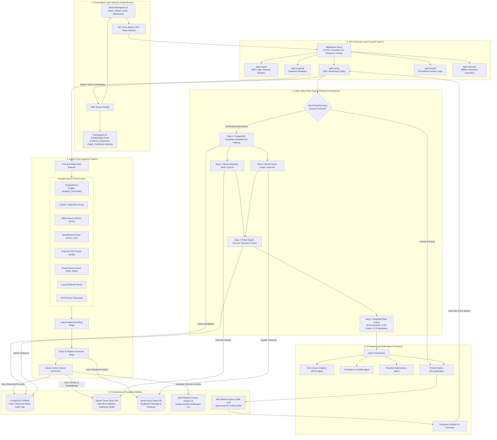

# IndustryBrain-AI: Enterprise Knowledge Intelligence Platform

**IndustryBrain-AI** (Codename: *Sangrahalayamu*) is an enterprise-grade Knowledge-Augmented Generation (KAG) and Multi-Agent Orchestration platform designed for industrial plant diagnostics, compliance management, and equipment failure intelligence. It bridges heterogeneous unstructured manuals, P&ID schematics, spreadsheets, CAD drawings, email archives, and operational logs with a 3-Way Hybrid Retrieval Engine (Qdrant Vector DB + Neo4j Graph DB + PostgreSQL Metadata RDBMS) and AWS Bedrock (Cohere Embed v3 + Qwen 235B LLM).

---

## 🏗️ Detailed System Architecture



---

## 🌟 Core Architecture Modules

### 1. Presentation Layer (Next.js 14 App Router)
- **Interactive Workspaces**: AI Chat (`/chat`), Ingestion Manager (`/upload`), Compliance Audit (`/audit`), and Metric Dashboards (`/`).
- **Transparency & Explainability**: Real-time rendering of reasoning steps, document citations, overall confidence metrics, and interactive Neo4j node relationship graphs.
- **Bearer JWT Injection**: Standardized client fetching automatically attaching authentication headers.

### 2. Decoupled API Layer (FastAPI `/api/v1`)
- **Middleware Chain**: Outermost CORS resolution, correlation ID context tracking, and response execution timing headers.
- **API Endpoints**: `/api/v1/auth`, `/api/v1/upload`, `/api/v1/chat`, `/api/v1/audit`, `/api/v1/access`, `/api/v1/dashboard`.

### 3. Multi-Format Industrial Ingestion Pipeline
- **Modality-Aware Inspection**: Auto-detects MIME types and magic byte headers for `.pdf`, `.docx`, `.xlsx`, `.csv`, `.pptx`, `.dxf` (AutoCAD drawings), `.msg`/`.eml`, `.log`, and images.
- **⚡ Low-Memory 8GB RAM Strategy (`ENABLE_DOCLING`)**:
  - `ENABLE_DOCLING=False` *(Default for 8GB RAM)*: Bypasses heavy PyTorch models. Activates high-speed native parsers (`PyMuPDF`, `pdfplumber`, `python-docx`, `openpyxl`, `ezdxf`) running in **`< 50MB RAM`** and completing in **`< 2s`**.
  - `ENABLE_DOCLING=True` *(For High-Memory GPU/Servers)*: Enables IBM Docling visual layout models.

### 4. 3-Way Hybrid RAG Retrieval Engine
- **Intent Routing Guard**: Bypasses vector DB search for general greetings (`"hi"`, `"hello"`).
- **PostgreSQL Candidate Pre-filtering**: Filters document candidate IDs using metadata tags.
- **Qdrant Vector Similarity**: Executes semantic vector search using **1024-dimension Cohere Embed v3** vectors.
- **Neo4j Graph Traversal**: Queries equipment topological node relationships (e.g. `P&ID 402` $\rightarrow$ `Valve V-102` $\rightarrow$ `Pump P-1`).
- **PolicyEngine RBAC Guard**: Filters candidates against user security clearance roles (CEO, Engineer, Technician).
- **Weighted Rank Fusion**: Merges scores using normalized weights (0.60 Semantic / 0.25 Graph / 0.15 Metadata).

### 5. Multi-Agent Reasoning & Foundation Layer
- **Autonomous Agents**: Root Cause Analysis (RCA), Compliance Verification, and Maintenance Recommendation agents.
- **AWS Bedrock Integration**: Cohere Embed v3 (`cohere.embed-multilingual-v3`) + Qwen 235B LLM (`qwen.qwen3-vl-235b-a22b`).

---

## ⚡ Quick Start Guide

### 1. Backend Execution
```bash
cd backend
python -m venv venv
venv\Scripts\activate      # Windows
# source venv/bin/activate # Mac/Linux

pip install -r requirements.txt
cp .env.example .env

# Seed test database users
python scripts/seed_users.py

# Start FastAPI server
uvicorn app.main:app --reload --port 8000
```

### 2. Frontend Execution
```bash
cd frontend
npm install
npm run dev
```
Open [http://localhost:3000](http://localhost:3000) in your browser.

---

### 🔑 Seed Test Credentials

| Role | Email | Password | Access Level |
| :--- | :--- | :--- | :--- |
| **CEO** | `cherry@company.com` | `password123` | Full Enterprise Clearance |
| **Maintenance Engineer** | `priya.sharma@company.com` | `password123` | Engineering & Maintenance |
| **Field Technician** | `ravi.kumar@company.com` | `password123` | Operational Logs & Manuals |
| **Compliance Manager** | `neha.iyer@company.com` | `password123` | Audit & Regulatory Compliance |
