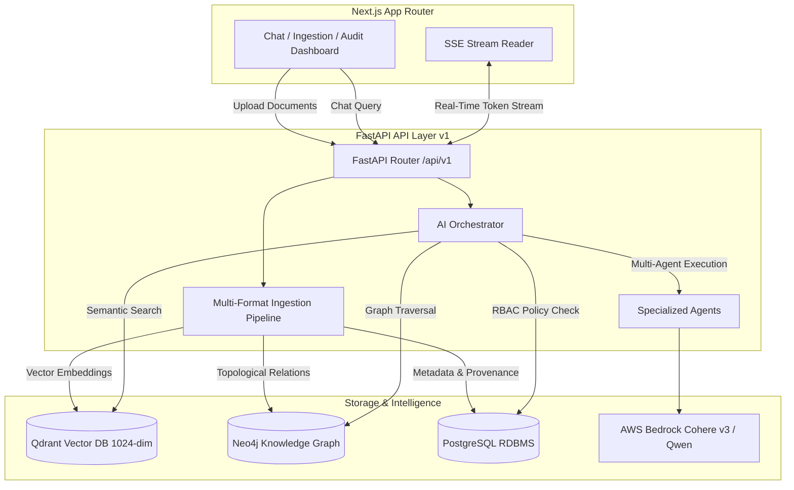

# IndustryBrain-AI: Enterprise Knowledge Intelligence Platform

**IndustryBrain-AI** (Codename: *Sangrahalayamu*) is an enterprise-grade Knowledge-Augmented Generation (KAG) and Multi-Agent Orchestration platform designed for industrial plant diagnostics, compliance management, and equipment failure intelligence. It bridges heterogeneous unstructured manuals, P&ID schematics, spreadsheets, CAD drawings, email archives, and operational logs with a 3-Way Hybrid Retrieval Engine (Qdrant Vector DB + Neo4j Graph DB + PostgreSQL Metadata RDBMS) and AWS Bedrock (Cohere Embed v3 + Qwen 235B LLM).

---

## 🏗️ System Architecture



---

## 🌟 Key Accomplishments & Technical Features

### 1. 3-Way Hybrid RAG Engine
- **Vector Search (Qdrant Cloud)**: Powered exclusively by AWS Bedrock **Cohere Embed v3** (`cohere.embed-multilingual-v3`) configured for **1024-dimension** vector spaces with automatic 96-item batching.
- **Knowledge Graph (Neo4j Cloud)**: Constructs topological equipment relationship graphs (e.g. `P&ID Drawing 402` $\rightarrow$ `Valve V-102` $\rightarrow$ `Pump P-1`).
- **PostgreSQL Pre-Filtering**: Applies role-based security clearances (CEO, Maintenance Engineer, Field Technician) and metadata constraints before vector/graph rank fusion.

### 2. Multi-Format Industrial Ingestion
- **Heterogeneous Document Support**: Native parsing for `.pdf` (manuals/P&IDs), `.docx`, `.xlsx`/`.csv` (tabular spreadsheets), `.pptx`, `.dxf` (AutoCAD drawings), `.msg`/`.eml` (email archives), `.log` (system traces), and images (OCR via Tesseract).
- **Zero Mock Data Mandate**: Real-world ingestion pipeline populating exact page numbers, bounding boxes, and provenance records.

### 3. ⚡ Low-Memory 8GB RAM Optimization & Boolean Docling Strategy (`ENABLE_DOCLING`)
To ensure high performance across both low-memory edge devices and high-end cloud servers:
- **The Challenge**: Heavy visual layout parsers like IBM Docling require PyTorch deep-learning models (Layout, TableFormer, OCR) that demand 16GB+ RAM. On 8GB RAM laptops, running Docling causes PyTorch memory allocation failures (`std::bad_alloc`).
- **The Solution (Boolean Switch Strategy)**: Implemented the `ENABLE_DOCLING` configuration flag (`backend/.env`):
  - **`ENABLE_DOCLING=False` (Default for 8GB RAM)**: Bypasses heavy PyTorch models. Activates high-speed native parsers (`PyMuPDF`, `pdfplumber`, `python-docx`, `openpyxl`, `ezdxf`) consuming **`< 50MB RAM`** and executing in **`< 2 seconds`** with 0 memory crashes.
  - **`ENABLE_DOCLING=True` (For High-Memory GPU/Servers)**: Dynamically activates IBM Docling deep layout models for visual document intelligence.

### 4. Dynamic Conversational Intent Routing
- Automatically distinguishes casual greetings (`"hi"`, `"hello"`, `"who are you"`) from domain queries. Conversational chat responds immediately with **0 vector DB lookups**, while technical questions dynamically trigger hybrid RAG.

### 5. Transparency & Explainability
- Every AI response includes clickable citations, confidence metrics, evidence strength, reasoning steps, and interactive node graph representations via the frontend Transparency Panel.

---

## 📂 Repository Structure

- [**`backend/`**](file:///d:/Engineering/Economic%20Times/IndustryBrain-AI/backend): FastAPI application, ingestion pipeline, hybrid retrieval orchestrator, DB providers, and seed tools.
- [**`frontend/`**](file:///d:/Engineering/Economic%20Times/IndustryBrain-AI/frontend): Next.js App Router interface, Lucide UI components, SSE streaming client, and interactive audit/transparency panels.

---

## ⚡ Quick Start Guide

### Prerequisites
- **Python**: 3.10+
- **Node.js**: 18+
- **Databases**: PostgreSQL, Qdrant Cloud (1024-dim), Neo4j Cloud.

---

### 1. Backend Setup

```bash
cd backend
python -m venv venv

# On Windows
venv\Scripts\activate
# On Mac/Linux
source venv/bin/activate

pip install -r requirements.txt
cp .env.example .env

# Seed default database accounts
python scripts/seed_users.py

# Start FastAPI server
uvicorn app.main:app --reload --port 8000
```

---

### 2. Frontend Setup

```bash
cd frontend
npm install
npm run dev
```

Open [http://localhost:3000](http://localhost:3000) in your browser.

---

### 🔑 Seed User Credentials for Testing

| Role | Email | Password | Access Level |
| :--- | :--- | :--- | :--- |
| **CEO** | `cherry@company.com` | `password123` | Full Enterprise Clearance |
| **Maintenance Engineer** | `priya.sharma@company.com` | `password123` | Engineering & Maintenance |
| **Field Technician** | `ravi.kumar@company.com` | `password123` | Operational Logs & Manuals |
| **Compliance Manager** | `neha.iyer@company.com` | `password123` | Audit & Regulatory Compliance |

---

## 📝 License & Attribution
Developed for Enterprise Knowledge Intelligence & Plant Operations Optimization.
