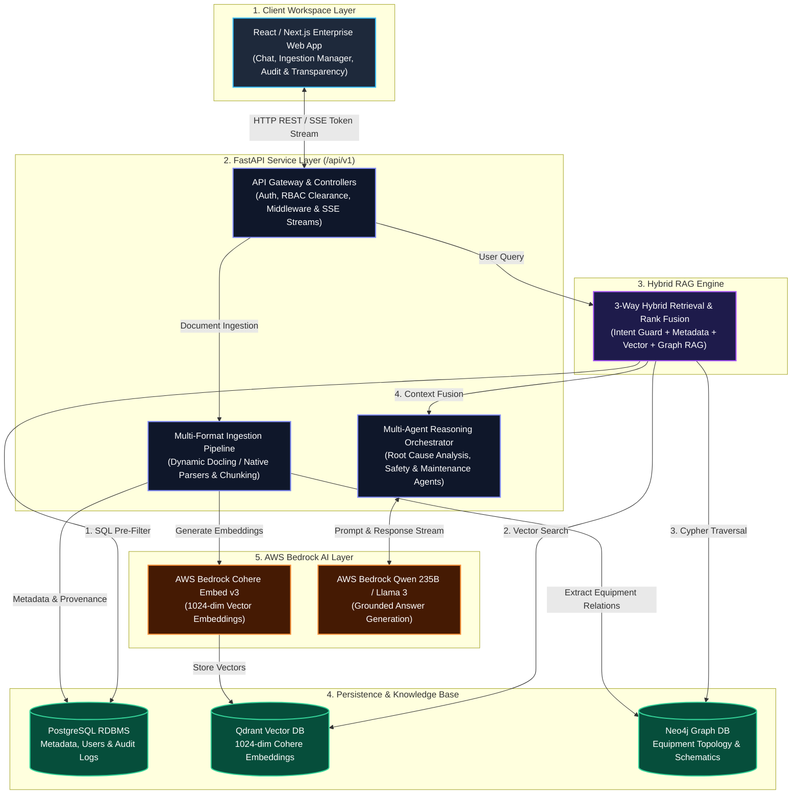

# IndustryBrain-AI: Enterprise Knowledge Intelligence Platform

**IndustryBrain-AI** (Codename: *Sangrahalayamu*) is an enterprise-grade Knowledge-Augmented Generation (KAG) and Multi-Agent Orchestration platform designed for industrial plant diagnostics, compliance management, and equipment failure intelligence. It bridges heterogeneous unstructured manuals, P&ID schematics, spreadsheets, CAD drawings, email archives, and operational logs with a 3-Way Hybrid Retrieval Engine (Qdrant Vector DB + Neo4j Graph DB + PostgreSQL Metadata RDBMS) and AWS Bedrock (Cohere Embed v3 + Qwen 235B LLM).

---

## 🏛️ High-Level System Architecture



---

## 🌟 Core System Pillars

### 1. 3-Way Hybrid RAG Engine
- **Vector Similarity (Qdrant Cloud)**: Driven exclusively by AWS Bedrock **Cohere Embed v3** (`cohere.embed-multilingual-v3`) configured for **1024-dimension** vectors.
- **Knowledge Graph (Neo4j Cloud)**: Maps plant equipment topology (e.g. `P&ID 402` $\rightarrow$ `Valve V-102` $\rightarrow$ `Pump P-1`).
- **PostgreSQL Pre-Filtering**: Applies role-based security clearances (CEO, Engineer, Technician) and metadata constraints before vector/graph rank fusion.

### 2. Multi-Format Industrial Ingestion
- Native support for `.pdf` (manuals/P&IDs), `.docx`, `.xlsx`/`.csv` (spreadsheets), `.pptx`, `.dxf` (AutoCAD schematics), `.msg`/`.eml` (email archives), `.log` (system traces), and scanned images (Tesseract OCR).

### 3. ⚡ Low-Memory 8GB RAM Optimization (`ENABLE_DOCLING`)
- **`ENABLE_DOCLING=False` (Default for 8GB RAM)**: Bypasses heavy PyTorch models. Activates high-speed native parsers (`PyMuPDF`, `pdfplumber`, `python-docx`, `openpyxl`, `ezdxf`) running in **`< 50MB RAM`** and **`< 2s`** with 0 memory crashes.
- **`ENABLE_DOCLING=True` (For High-Memory Servers)**: Enables IBM Docling visual layout models.

### 4. Dynamic Intent Routing & Transparency
- Bypasses vector DB searches for general greetings (`"hi"`, `"hello"`).
- Injects full document citations, confidence metrics, reasoning steps, and interactive node graphs for technical queries.

---

## ⚡ Quick Start Guide

### 1. Backend Execution
```bash
cd backend
python -m venv venv
venv\Scripts\activate      # Windows
# source venv/bin/activate # Mac/Linux

pip install -r requirements.txt
cp .env.example .env

# Seed test database users
python scripts/seed_users.py

# Start FastAPI server
uvicorn app.main:app --reload --port 8000
```

### 2. Frontend Execution
```bash
cd frontend
npm install
npm run dev
```
Open [http://localhost:3000](http://localhost:3000) in your browser.

---

### 🔑 Seed Test Credentials

| Role | Email | Password | Access Level |
| :--- | :--- | :--- | :--- |
| **CEO** | `cherry@company.com` | `password123` | Full Enterprise Clearance |
| **Maintenance Engineer** | `priya.sharma@company.com` | `password123` | Engineering & Maintenance |
| **Field Technician** | `ravi.kumar@company.com` | `password123` | Operational Logs & Manuals |
| **Compliance Manager** | `neha.iyer@company.com` | `password123` | Audit & Regulatory Compliance |
