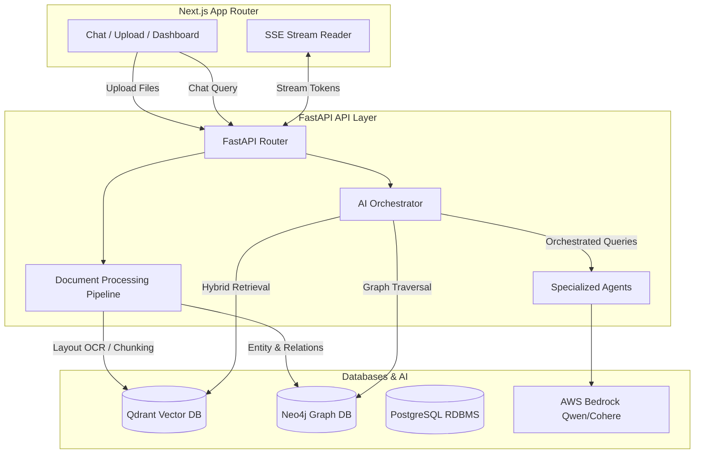

# IndustryBrain-AI: Enterprise Knowledge-Augmented Generation (KAG) Platform

IndustryBrain-AI is an enterprise-grade Knowledge-Augmented Generation (KAG) and Multi-Agent Orchestration platform designed for industrial plant diagnostics, compliance management, and equipment failure intelligence. It bridges unstructured manuals, schematics (P&IDs), and operational logs with an active Graph Reasoner (Neo4j) and Vector search space (Qdrant) to power specialized diagnostic agents (e.g., Root Cause Analysis, Compliance Verification) using AWS Bedrock Qwen.

---

## 🏗️ Project Architecture



---

## 🌟 Core System Features

1. **Enterprise Configuration System**: Fully centralized, secure settings powered by Pydantic Settings with nested modules for Database, AWS, Neo4j, Qdrant, and LLM/Embedding configurations.
2. **Layout-Aware Ingestion Pipeline**: Support for parsing documents with OCR, extracting mechanical/operational entities, and building topological equipment relationship graphs.
3. **Hybrid retrieval engine**: Integrates semantic vector similarity (Qdrant) and graph traversal constraints (Neo4j) using a weighted rank fusion approach.
4. **Specialized Multi-Agent Framework**: Modular, stateless reasoning agents that communicate via an Orchestrator:
   - **Root Cause Analysis (RCA) Agent**
   - **Compliance & Safety Agent**
   - **Failure Intelligence Agent**
   - **Proactive Maintenance Recommendation Agent**
5. **Decoupled API Layer**: High-performance FastAPI routers that strictly separate web controllers from business logic services.
6. **Streaming & Observability**: Real-time token streaming using Server-Sent Events (SSE) with structured final metadata (citations, reasoning steps, confidence metrics, and graph evidence).

---

## 📂 Repository Structure

- [**`backend/`**](file:///d:/Economic%20Times/IndustryBrain-AI/backend): Python FastAPI backend containing service orchestration, pipeline parsing, DB providers, and REST/SSE routers.
- [**`frontend/`**](file:///d:/Economic%20Times/IndustryBrain-AI/frontend): Next.js app using TailwindCSS and Lucide-react icons, integrated with the backend SSE chat stream and ingestion systems.

---

## ⚡ Quick Start

### Prerequisites
- Python 3.10+
- Node.js 18+
- PostgreSQL, Qdrant, and Neo4j instances running.

### 1. Start the Backend
Navigate to `/backend` and refer to the [Backend Setup Instructions](file:///d:/Economic%20Times/IndustryBrain-AI/backend/README.md).
```bash
cd backend
python -m venv venv
venv\Scripts\activate  # Windows
pip install -r requirements.txt
python scripts/seed_users.py
uvicorn app.main:app --reload --port 8000
```

### 2. Start the Frontend
Navigate to `/frontend` and refer to the [Frontend Setup Instructions](file:///d:/Economic%20Times/IndustryBrain-AI/frontend/README.md).
```bash
cd frontend
npm install
npm run dev
```
Open [http://localhost:3000](http://localhost:3000) to access the dashboard.
