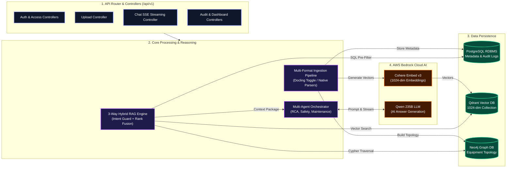

# IndustryBrain-AI: Enterprise Python Backend

High-performance Python backend powering **IndustryBrain-AI** (Codename: *Sangrahalayamu*). Built with **FastAPI**, **PostgreSQL**, **Neo4j Knowledge Graph**, **Qdrant Vector DB**, and **AWS Bedrock** (Cohere Embed v3 + Qwen 235B LLM).

---

## 🏛️ Backend High-Level Architecture



---

## ⚡ Backend Core Pillars

### 1. Low-Memory 8GB RAM Strategy (`ENABLE_DOCLING`)
- IBM Docling relies on heavy PyTorch deep learning models (16GB+ RAM requirement).
- Controlled via `ENABLE_DOCLING` in `backend/.env`:
  - **`ENABLE_DOCLING=False` (Default for 8GB RAM)**: Bypasses PyTorch models. Uses lightweight native parsers (`PyMuPDF`, `pdfplumber`, `python-docx`, `openpyxl`, `ezdxf`, `extract-msg`) running in **`< 50MB RAM`** and completing in **`< 2s`**.
  - **`ENABLE_DOCLING=True` (For High-Memory GPU/Servers)**: Enables IBM Docling visual layout models.

### 2. Exclusive Cohere Embed v3 Integration (1024-dim)
- Provider: `BedrockEmbeddingProvider` (`cohere.embed-multilingual-v3`).
- Sub-batching in chunks of **96 items** to satisfy AWS Bedrock's 128 max item limit.
- Qdrant Cloud collection (`Enterprise_Brain`) configured for **1024 vector dimensions** with keyword payload indices (`document_id`, `workspace_id`, `role_permissions`).

### 3. Dynamic Conversational Intent Routing
- Detects casual greetings (`"hi"`, `"hello"`) and responds immediately with **0 vector DB calls**.
- Technical questions dynamically trigger 3-way hybrid retrieval (PostgreSQL metadata pre-filtering $\rightarrow$ Qdrant vector search $\rightarrow$ Neo4j graph traversal $\rightarrow$ Weighted Rank Fusion).

---

## 📂 Backend Directory Structure

```
backend/
├── app/
│   ├── api/                  # Decoupled FastAPI REST & SSE routers (/api/v1/*)
│   │   ├── auth.py           # JWT Authentication & session management
│   │   ├── access.py         # Temporary RBAC clearance overrides
│   │   ├── audit.py          # Compliance & security event logs
│   │   ├── dashboard.py      # Summary metrics & repository stats
│   │   └── routers/          # Upload, chat, graph, agents, and health endpoints
│   ├── core/                 # Centralized Pydantic Settings & environment config
│   ├── database/             # SQLAlchemy engine & Qdrant vector client
│   ├── models/               # SQLAlchemy ORM models (User, Document, AuditLog)
│   └── services/             # Core business & AI reasoning services
│       ├── processing/       # Multi-format ingestion pipeline & Docling toggle
│       ├── retrieval/        # 3-Way Hybrid RAG Orchestrator & rank fusion
│       ├── embeddings/       # Cohere Embed v3 provider (1024-dim, sub-batched)
│       ├── graph/            # Neo4j graph provider & Cypher builders
│       ├── ai/               # AI Orchestrator, SSE stream generator & prompts
│       ├── validation/       # Response validator & transparency formatters
│       └── conversation/     # Session history manager
└── scripts/                  # Seed tools & stack diagnostic scripts
```

---

## 🚀 Setup & Execution

### 1. Environment Setup
```bash
cp .env.example .env
```
Ensure credentials for PostgreSQL, Qdrant Cloud, Neo4j Cloud, and AWS Bedrock are configured in `.env`.

### 2. Run Database Seeder
```bash
python scripts/seed_users.py
```
*Seeds default roles and accounts (Default Password for all: `password123`).*

### 3. Start Development Server
```bash
uvicorn app.main:app --reload --port 8000
```
Interactive OpenAPI documentation will be live at `http://localhost:8000/docs`.
