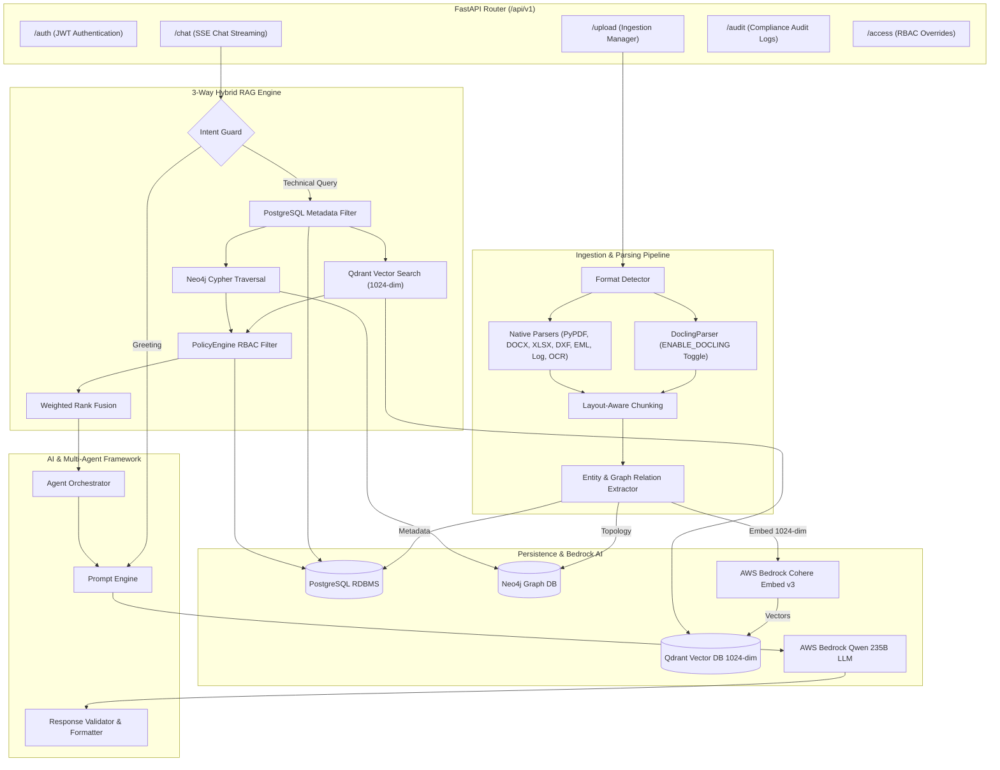

# IndustryBrain-AI: Enterprise Python Backend

High-performance Python backend powering **IndustryBrain-AI** (Codename: *Sangrahalayamu*). Built with **FastAPI**, **PostgreSQL**, **Neo4j Knowledge Graph**, **Qdrant Vector DB**, and **AWS Bedrock** (Cohere Embed v3 + Qwen 235B LLM).

---

## 🏗️ Detailed Architecture & Component Flow



---

## ⚡ Technical Highlights

### 1. Low-Memory 8GB RAM Strategy (`ENABLE_DOCLING`)
- IBM Docling relies on heavy PyTorch deep learning models (16GB+ RAM requirement).
- Controlled via `ENABLE_DOCLING` in `backend/.env`:
  - **`ENABLE_DOCLING=False` (Default for 8GB RAM)**: Bypasses PyTorch models. Uses lightweight native parsers (`PyMuPDF`, `pdfplumber`, `python-docx`, `openpyxl`, `ezdxf`, `extract-msg`) running in **`< 50MB RAM`** and completing in **`< 2s`**.
  - **`ENABLE_DOCLING=True` (For High-Memory GPU/Servers)**: Enables IBM Docling visual layout models.

### 2. Exclusive Cohere Embed v3 Integration (1024-dim)
- Provider: `BedrockEmbeddingProvider` (`cohere.embed-multilingual-v3`).
- Sub-batching in chunks of **96 items** to satisfy AWS Bedrock's 128 max item limit.
- Qdrant Cloud collection (`Enterprise_Brain`) configured for **1024 vector dimensions** with keyword payload indices (`document_id`, `workspace_id`, `role_permissions`).

### 3. Dynamic Conversational Intent Routing
- Detects casual greetings (`"hi"`, `"hello"`) and responds immediately with **0 vector DB calls**.
- Technical questions dynamically trigger 3-way hybrid retrieval (PostgreSQL metadata pre-filtering $\rightarrow$ Qdrant vector search $\rightarrow$ Neo4j graph traversal $\rightarrow$ Weighted Rank Fusion).

---

## 🚀 Execution & Configuration

### 1. Environment Setup
```bash
cp .env.example .env
```
Ensure credentials for PostgreSQL, Qdrant Cloud, Neo4j Cloud, and AWS Bedrock are configured in `.env`.

### 2. Run Database Seeder
```bash
python scripts/seed_users.py
```
*Seeds default roles and accounts (Default Password for all: `password123`).*

### 3. Start Development Server
```bash
uvicorn app.main:app --reload --port 8000
```
Interactive OpenAPI documentation will be live at `http://localhost:8000/docs`.
