# IndustryBrain-AI: Next.js Frontend Client

The frontend client for **IndustryBrain-AI** (Codename: *Sangrahalayamu*). Built with **Next.js 14 App Router**, **TypeScript**, **TailwindCSS**, **Lucide UI Icons**, **Zustand State Stores**, and integrated with the FastAPI backend via Server-Sent Events (SSE) streaming and REST services.

---

## 🏛️ Frontend High-Level Architecture

```mermaid
graph LR
    classDef page fill:#1e293b,stroke:#38bdf8,stroke-width:2px,color:#fff;
    classDef feature fill:#0f172a,stroke:#818cf8,stroke-width:2px,color:#fff;
    classDef service fill:#1e1b4b,stroke:#a855f7,stroke-width:2px,color:#fff;
    classDef api fill:#064e3b,stroke:#34d399,stroke-width:2px,color:#fff;

    subgraph Pages ["1. App Router Views"]
        P1["/chat Workspace"]:::page
        P2["/upload Ingestion Studio"]:::page
        P3["/audit Compliance Log"]:::page
        P4["/ Metric Dashboard"]:::page
    end

    subgraph Modules ["2. Feature Modules & State"]
        F1["Chat & Context Bar"]:::feature
        F2["Ingestion Manager"]:::feature
        F3["Transparency & Node Graph Panel"]:::feature
        F4["RBAC & Persona Store"]:::feature
    end

    subgraph Services ["3. Network & Service Layer"]
        S1["ApiClient (Bearer JWT Injector)"]:::service
        S2["AuthService"]:::service
        S3["UploadService"]:::service
        S4["SSE Stream Reader"]:::service
    end

    subgraph BackendAPI ["4. Backend Integration"]
        B1["FastAPI Server (/api/v1/*)"]:::api
    end

    Pages --> Modules
    Modules --> Services
    Services <-->|HTTP REST & SSE Token Stream| BackendAPI
```



---

## 🛠️ Key UI Features & Views

1. **Dashboard Overview (`/`)**: High-level repository metrics, recent document activity timelines, and system health status.
2. **Document Ingestion Studio (`/upload`)**: Drag-and-drop multi-file upload manager supporting heterogeneous formats (`.pdf`, `.docx`, `.xlsx`, `.csv`, `.pptx`, `.dxf`, `.msg`, `.log`, scanned images).
3. **AI Chat & Transparency Workspace (`/chat`)**:
   - Real-time token streaming using Server-Sent Events (SSE).
   - **Split-Screen Transparency Panel**: Visualizes confidence scores, document coverage, exact page citation text snippets, step-by-step reasoning logs, and interactive Neo4j equipment node relationship graphs.
4. **Audit & Compliance Log (`/audit`)**: Security activity logs tracking clearance requests, document uploads, and user retrieval events.

---

## 📂 Frontend Directory Structure

```
frontend/
├── app/                      # Next.js 14 App Router pages (/chat, /upload, /audit, /login)
├── components/               # Atomic UI widgets and icons
├── features/                 # Feature-specific module components
│   ├── chat/                 # Chat input, message bubbles, context bar, sidebars
│   ├── upload/               # Ingestion dropzone, metadata forms, progress reviews
│   ├── transparency/         # Reasoning steps, citation drawers, graph visualizers
│   ├── persona/              # RBAC permission guards and role definitions
│   └── dashboard/            # Summary cards, activity timelines, document tables
├── services/                 # API service wrappers (auth-service.ts, chat-service.ts)
├── store/                    # Zustand state management context
└── lib/                      # Network layer (api-client.ts with Bearer token injector)
```

---

## 🚀 Setup & Development Execution

### 1. Install Node Dependencies
Ensure Node.js 18+ is installed:
```bash
npm install
```

### 2. Configure Environment Variables
Create a `.env.local` file in `/frontend`:
```bash
NEXT_PUBLIC_API_URL=http://localhost:8000
```

### 3. Start Development Server
```bash
npm run dev
```
Open [http://localhost:3000](http://localhost:3000) to launch the workspace.
